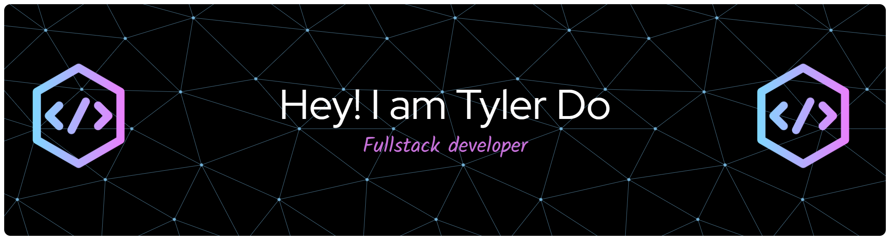

{: style="width:150px; border-radius:50%;" }

# Welcome!

Hi, I'm **Tyler Do**, a junior Computer Science student at the University of Maryland, College Park.  

This site showcases my **projects, skills, and resume**. Feel free to explore the pages below for more information.

- 📄 [Personal Statement](introduction.md)  
- 💻 [Projects](projects.md)  
- 📜 [Resume (PDF)](assets/TylerDoResume.pdf) 

## Skills Snapshot

**Programming Languages:**  
Java, Javascript, Python, C++, C, OCaml, Racket, Rust, Pandas, SQL, Y86-64 Assembly, A86 Assembly

**Software & Tools:**  
Git, GitHub, Visual Studios Code, Linux (Ubuntu), Eclipse, Bitvise SSH Client  

**Web Development:**  
HTML, CSS, Node.js  

**Soft Skills:**  
Collaboration, Communication, Problem Solving, Time Management, Consistent, Attention to Detail, Flexibility, Dedicated

## GitHub Pages
- [MaybeTylerDo](https://github.com/MaybeTylerDo)
- [NotTylerDo](https://github.com/NotTylerDo)

## Contact Info
- 240-744-6578
- tyler.do248@gmail.com
